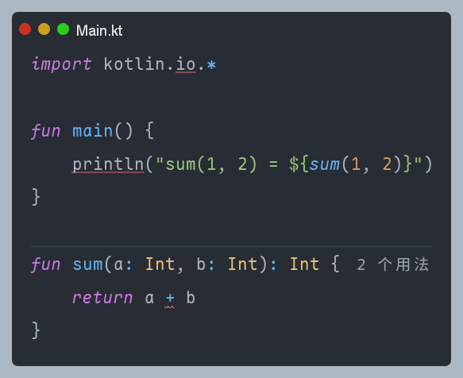
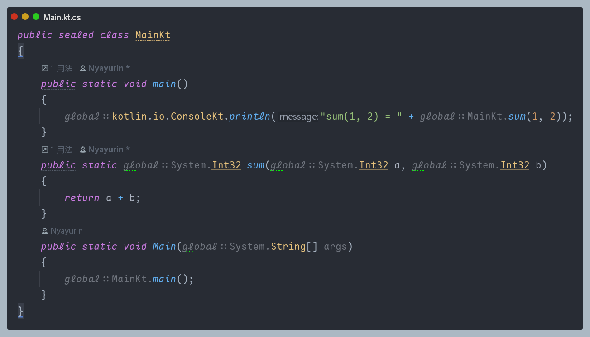

# Kotlin CLR Backend Compiler

这是一个 Kotlin CLR 后端编译器, 旨在将 Kotlin 代码编译为 .NET CIL, 使得 Kotlin 开发者可以在 .NET 平台上使用 Kotlin 语言进行开发 

## 样例

### [Read from the standard input](https://kotlinlang.org/docs/basic-syntax.html#read-from-the-standard-input)

### [Functions](https://kotlinlang.org/docs/basic-syntax.html#functions)

## 项目结构
- `compiler` 编译器核心, 使用 Kotlin/JVM 编写, 依赖官方的 kotlin-compiler-embeddable
  - `home` kotlin-home
    - `clr/lib` Kotlin/CLR 标准库(.dll)
    - `jvm/lib` Kotlin/JVM 标准库(.jar)
  - `src/commonMain/kotlin` 编译器核心代码
    - `Library.kt` Kotlin/CLR 标准库编译入口
    - `MainCLR.kt` Kotlin/CLR 编译入口
    - `MainJVM.kt` 官方 Kotlin/JVM 编译入口
- `csharp` C# 部分
  - `AssemblyResolver` 使用 C# 基于 Assembly API 实现的程序集解析器, 用于解析 .dll 文件并传递给 Kotlin/CLR 编译器
  - `kotlin-stdlib` Kotlin 标准库的 C# 实现, 用于提供 Kotlin 标准库的支持
  - `KotlinCLR` 一个常规的 C# 项目, 用于测试和演示
  - `KotlinCLR/gen` 包含从 `kotlin` 编译而来的 C# 代码
- `kotlin` 一个使用 Kotlin/CLR 的 Kotlin 项目, 用于测试和演示
- `stdlib` Kotlin/CLR 编写的标准库, 暂未使用, 作为未来的标准库实现

## 使用
1. 使用 Intellij IDEA 打开本项目, 使用 Rider / Visual Studio 打开 `csharp` 子目录
2. 使用 Rider / Visual Studio 构建 `AssemblyResolver` 项目
3. 使用 Intellij IDEA 运行 Gradle 任务 `:compiler:jvmRun -DmainClass=MainCLRKt` 即可将 `kotlin` 目录内的源码编译至 `csharp/KotlinCLR/gen` 目录下
4. 使用 Rider / Visual Studio 运行 `KotlinCLR` 项目 

## 原理
1. 使用官方 kotlin-compiler-embeddable, 复用官方编译器组件进行 Configuration, Frontend, Fir2Ir 编译
2. 编写 Kotlin/CLR 后端编译器将 Kotlin IR 降级并生成 C# 源码
3. 使用 C# 编写的 AssemblyResolver 解析 .dll 文件, 并将其传递给 Kotlin/CLR 编译器
4. 使用 C# 编写的标准库和 AssemblyResolver 为 Kotlin/CLR 提供标准库
5. 通过 ClrSymbolProvider 提供 C# 的符号解析, 使得 Kotlin/CLR 可以使用 C# 的类型和方法

## 为什么编译到 C# 而不是直接编译到 CIL?
短期内编译到 C# 可以更快见效, 性价比更高, 未来会直接生成 CIL

## 为什么使用 C# 编写标准库而不是 Kotlin?
编译器还没搓完, 部分语法还没支持, 编译 Kotlin 标准库会报错(x

## [交流群](https://qm.qq.com/q/ed5aIJqOrK)